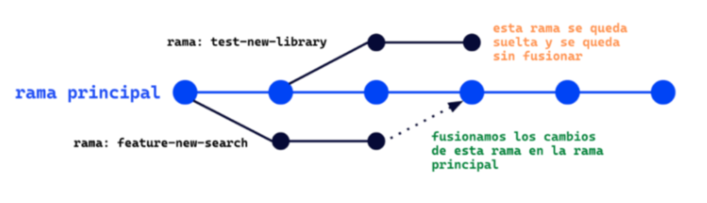
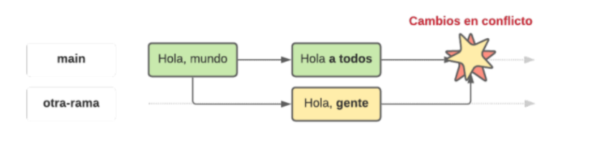

# ramas en git y conflictos

una rama es como una copia del proyecto para no romper nada mientras trabajas
es como hacer una version separada pa no tocar el main

en equipos sirve pa que cada quien haga lo suyo y despues juntarlo

# como se crean y eliminan

- git branch mi-rama
- git switch mi-rama
- git switch -c mi-rama

pa borrar

- git branch -d mi-rama si ya fue fusionada
- git branch -D mi-rama si no fue pero igual la queres borrar

# que es merge

merge sirve pa juntar los cambios de una rama con otra

por ejemplo estas en main y haces

- git merge mi-rama

si hay cambios en el mismo archivo git no sabe que parte dejar y ahi viene el conflicto

# conflictos

cuando pasa eso git mete unas marcas raras en el archivo que vos no pusiste

asi:

<<<<<<< HEAD
cosas que estaban en main
=======
cosas que vienen de la otra rama
>>>>>>> rama

tenes que elegir cual parte dejar o unir las dos

# tips

- no borres una rama si no estas seguro que fue fusionada
- lee bien antes de resolver un conflicto
- usa git diff pa ver mejor los cambios