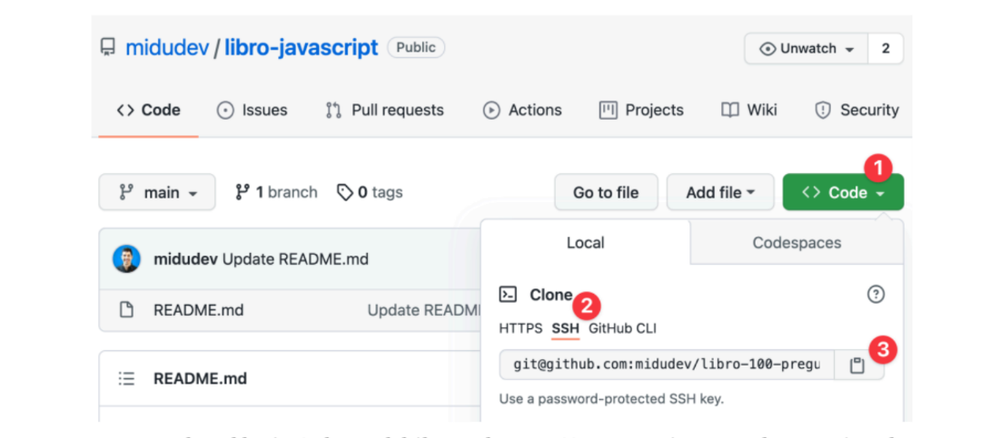

# git y github no son lo mismo

git es una herramienta pa llevar el control de versiones en un proyecto
te deja guardar los cambios y volver atras si pasa algo
puedes trabajar en local sin internet y guardar todo en tu compu

pero github es como la nube pa subir eso
ademas te da una pagina web pa ver los archivos
hacer PRs ver el historial colaborar con mas gente

# repositorios remotos

los repos remotos son versiones que estan en internet y sirven pa trabajar en grupo

por ejemplo podes tener tu proyecto en github y sincronizarlo con tu pc

# clonar repositorio

pa clonar un repo necesitamos el link
puede ser SSH o HTTPS
lo mas usado es SSH por seguridad



```bash
git clone git@github.com:usuario/repositorio.git
```

o si usas HTTPS

```bash
git clone https://github.com/usuario/repositorio.git
```

# como enlazar un repo local con uno remoto

si ya tenes un proyecto en tu compu y queres conectarlo con github
usas el siguiente comando

```bash
git remote add origin <url-del-repo>
```

asi le decis a git que ese es el repo principal en remoto

# subir cambios (push)

cuando haces cambios y los confirmas (con commit)
los podes subir al repo remoto con:

```bash
git push origin main
```

origin es el alias del repo remoto
main es la rama

# errores al hacer push

si te dice que fue rechazado puede ser porque alguien ya subio algo al remoto
y tenes que traer esos cambios antes de empujar los tuyos

tambien puede pasar si estas en una rama que no existe en el remoto

ejemplo:

```bash
git push origin rama-que-no-existe
```

esto te va a dar un error porque el remoto no conoce esa rama

# crear y subir ramas nuevas

si haces una nueva rama podes subirla asi

```bash
git switch -c nueva-rama
git push origin nueva-rama
```

ahi ya queda creada en github y podes empezar a trabajar